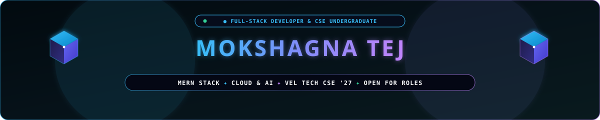
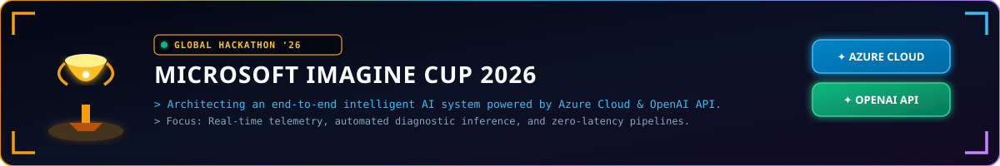
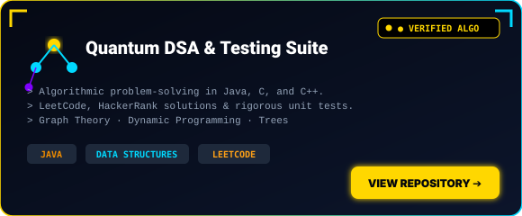
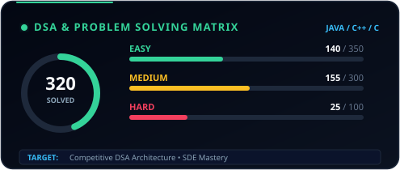

<!-- ============================================================================== -->
<!-- 🌌 00. CLEAN 3D HERO BANNER -->
<!-- ============================================================================== -->

  
  
  
  

<!-- ⚡ CLEAN DYNAMIC TYPING -->

 

<!-- ============================================================================== -->
<!-- ✦ ABOUT ME -->
<!-- ============================================================================== -->

## ✦ About Me

I'm **Mokshagna Tej**, a 3rd-year Computer Science undergraduate at **Vel Tech University** (`VTU29491`), engineering at the intersection of robust systems architecture and sleek UI/UX design.

* 🚀 **Full-Stack & Cloud:** Building scalable applications using the **MERN stack**, Flask, and Microsoft Azure.
* 🏆 **Imagine Cup '26:** Developing an end-to-end AI anomaly system for the global competition using Azure & OpenAI.
* 🧩 **DSA Problem Solver:** Grinding advanced algorithmic challenges in **Java**, **C**, and **C++**.
* 💼 **Experience:** Previously software development intern at **Innolift Ventures (Track-3)** and editorial layout designer for **VTU Chronicle**.

 

| 🎓 Academic Orbit | 🏫 Base Station | 🆔 Cyber ID | 🏆 Prime Directive |
| :---: | :---: | :---: | :---: |
| **3rd-Year CSE** | **Vel Tech University** | `VTU29491` | **Imagine Cup '26 Finalist Quest** |

 

<!-- ============================================================================== -->
<!-- ⚡ TECH ARSENAL -->
<!-- ============================================================================== -->

## ⚡ Tech Arsenal

<!-- 3D Skill Icons Strip -->

  

 

<!-- ============================================================================== -->
<!-- 🪐 FEATURED PROJECTS -->
<!-- ============================================================================== -->

## 🪐 Featured Projects

<!-- Imagine Cup 2026 Banner -->

  

<!-- Clean 2x2 Bento Project Cards -->
<table width="100%">
  <tr>
    <td width="50%" valign="top">
      
    </td>
    <td width="50%" valign="top">
      
    </td>
  </tr>
  <tr>
    <td width="50%" valign="top">
      
    </td>
    <td width="50%" valign="top">
      
    </td>
  </tr>
</table>

 

<!-- ============================================================================== -->
<!-- 📊 GITHUB ANALYTICS -->
<!-- ============================================================================== -->

## 📊 GitHub Analytics & System State

<!-- Live Dynamic Status State -->

  

<!-- Automated 2x2 Bento Stats & Graphs Cards -->
<table width="100%">
  <tr>
    <td width="50%" valign="top">
      
    </td>
    <td width="50%" valign="top">
      
    </td>
  </tr>
  <tr>
    <td width="100%" colspan="2" valign="top">
      
    </td>
  </tr>
</table>

 

<!-- Animated Contribution Snake -->

 

<!-- ============================================================================== -->
<!-- 📡 LET'S CONNECT -->
<!-- ============================================================================== -->

## 📡 Let's Connect

Code reveals what I build — **[LinkedIn](https://www.linkedin.com/in/mokshagna-tej-kalepalli-45220a359)** reveals my vision and journey.

 

  
  &nbsp;
  

 

> ⚡ *"I blend clean code with great design to build web apps that work as good as they look."*

 

<!-- Clean Animated Wave Footer -->

