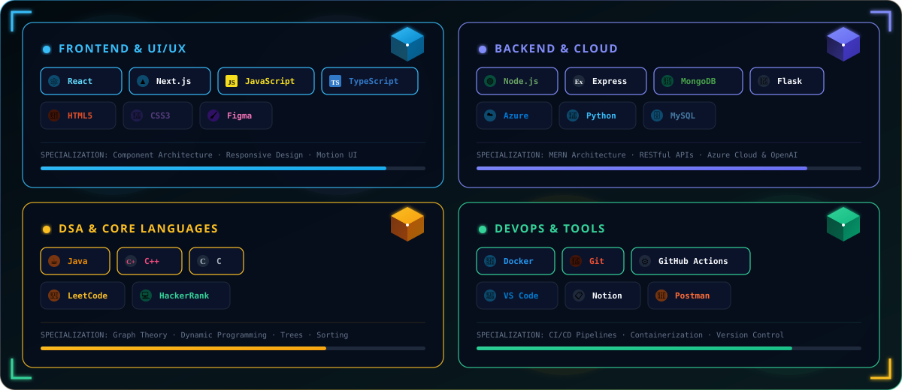

<!-- ============================================================================== -->
<!-- 🌌 00. 3D ISOMETRIC HERO BANNER — DEVELOPER WORKSTATION -->
<!-- ============================================================================== -->

 

<!-- ⚡ Dynamic Typing Animation -->

 

<!-- 🏷️ Quick-Action 3D Badges -->

  
  
  
  

 

<!-- ============================================================================== -->
<!-- 🧊 01. 3D BENTO STUDENT & ENGINEERING HUB -->
<!-- ============================================================================== -->

## 🧊 Student & Engineering Hub

 

I'm **Mokshagna Tej**, a 3rd-year Computer Science undergraduate at **Vel Tech University** (`VTU29491`), engineering at the intersection of robust systems architecture and sleek UI/UX design.

* 🚀 **Full-Stack & Cloud:** Building scalable applications using the **MERN stack**, Flask, and Microsoft Azure.
* 🏆 **Imagine Cup '26:** Developing an end-to-end AI anomaly system for the global competition using Azure & OpenAI.
* 🧩 **DSA Problem Solver:** Grinding advanced algorithmic challenges in **Java**, **C**, and **C++**.
* 💼 **Experience:** Previously software development intern at **Innolift Ventures (Track-3)** and editorial layout designer for **VTU Chronicle**.

 

<!-- ============================================================================== -->
<!-- ⚡ 02. 3D CATEGORIZED TECH ARSENAL -->
<!-- ============================================================================== -->

## ⚡ Tech Arsenal

<!-- 3D Categorized Tech Arsenal SVG -->

  

<!-- Skill Icons Strip (fallback for quick visual scan) -->

  

 

<!-- ============================================================================== -->
<!-- 🪐 03. 3D FEATURED PROJECTS SHOWCASE -->
<!-- ============================================================================== -->

## 🪐 Featured Projects

<!-- 🏆 Imagine Cup 2026 — Flagship Hero Banner -->

  

<!-- 3D Bento Project Cards — 2x3 Grid -->
<table width="100%">
  <tr>
    <td width="50%" valign="top">
      
    </td>
    <td width="50%" valign="top">
      
    </td>
  </tr>
  <tr>
    <td width="50%" valign="top">
      
    </td>
    <td width="50%" valign="top">
      
    </td>
  </tr>
</table>

 

<!-- ============================================================================== -->
<!-- 📊 04. 3D GITHUB ANALYTICS & ENGINEERING VELOCITY -->
<!-- ============================================================================== -->

## 📊 GitHub Analytics & System State

<!-- Live Dynamic Status Radar -->

  

<!-- 3D Isometric 2x2 Bento Analytics Grid -->
<table width="100%">
  <tr>
    <td width="50%" valign="top">
      
    </td>
    <td width="50%" valign="top">
      
    </td>
  </tr>
  <tr>
    <td width="50%" valign="top">
      
    </td>
    <td width="50%" valign="top">
      
    </td>
  </tr>
</table>

 

<!-- Animated Contribution Snake -->

 

<!-- ============================================================================== -->
<!-- 🏆 05. GITHUB TROPHIES & ACTIVITY -->
<!-- ============================================================================== -->

## 🏆 GitHub Trophies

  

<!-- GitHub Activity Graph -->

 

<!-- ============================================================================== -->
<!-- 📡 06. CONNECT & FOOTER -->
<!-- ============================================================================== -->

## 📡 Let's Connect

Code reveals what I build — **[LinkedIn](https://www.linkedin.com/in/mokshagna-tej-kalepalli-45220a359)** reveals my vision and journey.

 

  
  &nbsp;
  
  &nbsp;
  

 

> ⚡ *"I blend clean code with great design to build web apps that work as good as they look."*

 

<!-- Animated Wave Footer -->

