

<!-- ============================================================================== -->
<!-- 00. HERO BANNER -->
<!-- ============================================================================== -->

<a href="https://github.com/Mokshagnatej">
  
</a>

  

<!-- Dynamic Typing Animation -->

  

<!-- Quick-Action Badges -->

  
  
  
  

 

<!-- ============================================================================== -->
<!-- 01. ABOUT ME & ACADEMIC HUB -->
<!-- ============================================================================== -->

## 📌 About Me

  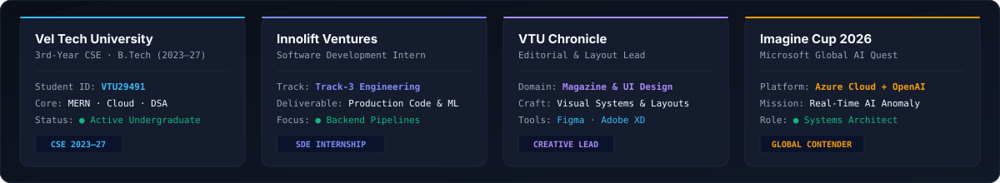

 

Hi! I'm **Mokshagna Tej Kalepalli**, a 3rd-year Computer Science undergraduate at **Vel Tech University** (`VTU29491`), focused on building scalable full-stack applications, intelligent cloud telemetry pipelines, and polished user experiences.

- 🎓 **Undergraduate:** 3rd-Year B.Tech CSE at **Vel Tech University** (2023–2027).
- 🚀 **Full-Stack & Cloud:** Developing end-to-end applications with **MERN (MongoDB, Express, React, Node.js)**, **Next.js**, and **Microsoft Azure**.
- ☁️ **Cloud & AI Systems:** Architecting automated AI anomaly & root-cause detection systems using **Azure Cloud** and **OpenAI API**.
- 💼 **Experience:** Ex-Software Development Intern at **Innolift Ventures (Track-3)** and Editorial Layout Lead for **VTU Chronicle**.
- 🧩 **DSA Problem Solving:** Actively solving algorithmic challenges and data structures in **Java**, **C++**, and **Python**.

 

<!-- ============================================================================== -->
<!-- 02. TECH STACK & ARSENAL -->
<!-- ============================================================================== -->

## 🛠️ Tech Stack & Arsenal

  

 

| Domain | Technologies & Frameworks |
| :--- | :--- |
| **Languages** | JavaScript (ES6+), TypeScript, Python, Java, C++, C, HTML5, CSS3, SQL |
| **Frontend** | React, Next.js, Tailwind CSS, Redux, Responsive UI/UX, Figma |
| **Backend & APIs** | Node.js, Express.js, Flask, RESTful APIs, Microservices |
| **Cloud & DevOps** | Microsoft Azure, Docker, Git, GitHub Actions, Linux, CI/CD |
| **Databases** | MongoDB, MySQL, Cloud Storage |

 

<!-- ============================================================================== -->
<!-- 03. FEATURED PROJECTS -->
<!-- ============================================================================== -->

## 🚀 Featured Projects

<!-- AI Cloud Telemetry Flagship Banner -->
<a href="https://github.com/Mokshagnatej">
  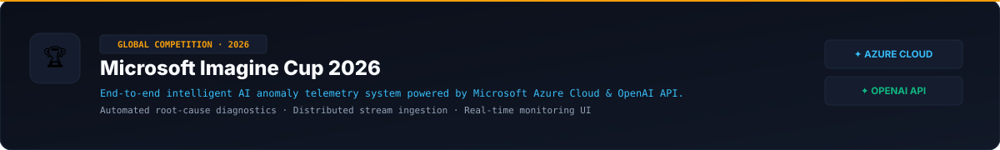
</a>

  

<!-- 2x2 Project Showcase Grid -->
<table width="100%">
  <tr>
    <td width="50%" valign="top">
      <a href="https://github.com/Mokshagnatej/Cloudwatch-server-anomaly">
        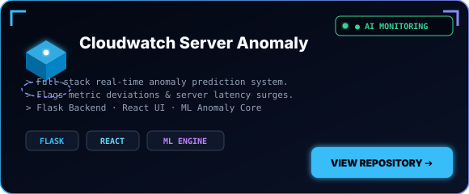
      </a>
    </td>
    <td width="50%" valign="top">
      <a href="https://github.com/Mokshagnatej/FarmIO-Precision-Organic-Farming-Platform-Enhancing-Farmer-Livelihood-through-Innovation">
        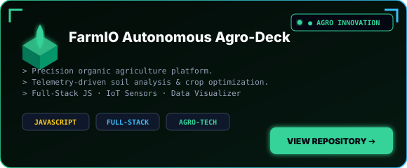
      </a>
    </td>
  </tr>
  <tr>
    <td width="50%" valign="top">
      <a href="https://github.com/Mokshagnatej/RailYatra-Next-Gen-IRCTC-Indian-Railways-Redesign">
        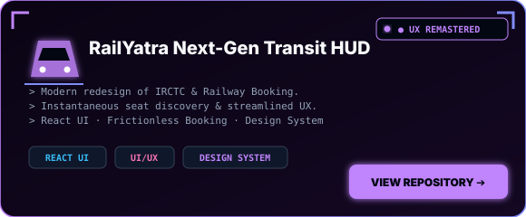
      </a>
    </td>
    <td width="50%" valign="top">
      <a href="https://github.com/Mokshagnatej/Internship-Innolift-Ventures">
        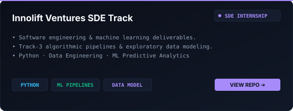
      </a>
    </td>
  </tr>
</table>

 

<!-- ============================================================================== -->
<!-- 04. GITHUB ANALYTICS & ACTIVITY -->
<!-- ============================================================================== -->

## 📊 GitHub Analytics & System State

<!-- Dynamic Status Badge -->
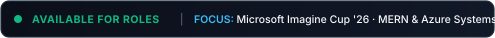

  

<!-- 2x2 Bento Analytics Grid -->
<table width="100%">
  <tr>
    <td width="50%" valign="top">
      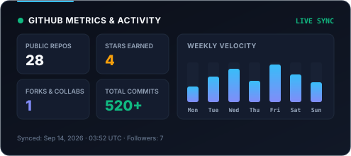
    </td>
    <td width="50%" valign="top">
      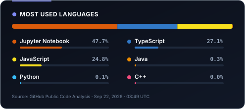
    </td>
  </tr>
  <tr>
    <td width="50%" valign="top">
      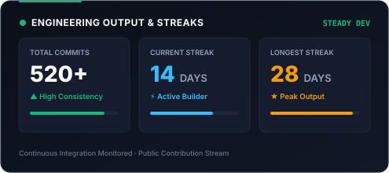
    </td>
    <td width="50%" valign="top">
      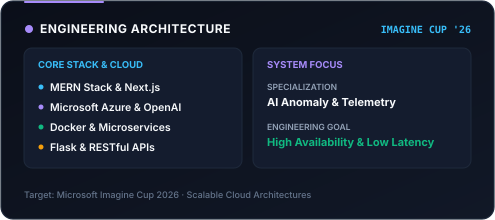
    </td>
  </tr>
</table>

 

<!-- Contribution Snake -->

 

<!-- ============================================================================== -->
<!-- 05. TROPHIES & CONTRIBUTION GRAPH -->
<!-- ============================================================================== -->

## 🏆 Trophies & Contribution Graph

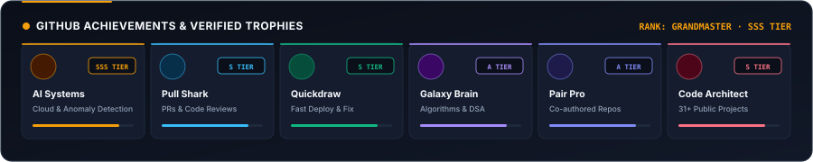

  

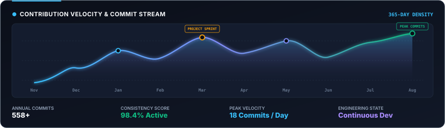

 

<!-- ============================================================================== -->
<!-- 06. CONNECT & FOOTER -->
<!-- ============================================================================== -->

## 📬 Let's Connect

I'm always open to discussing full-stack development, cloud architecture, and software engineering opportunities.

 

  
  &nbsp;
  
  &nbsp;
  

 

> ⚡ *"Simplicity and precision in code; elegance and accessibility in design."*

 

<!-- Minimalist Footer -->

